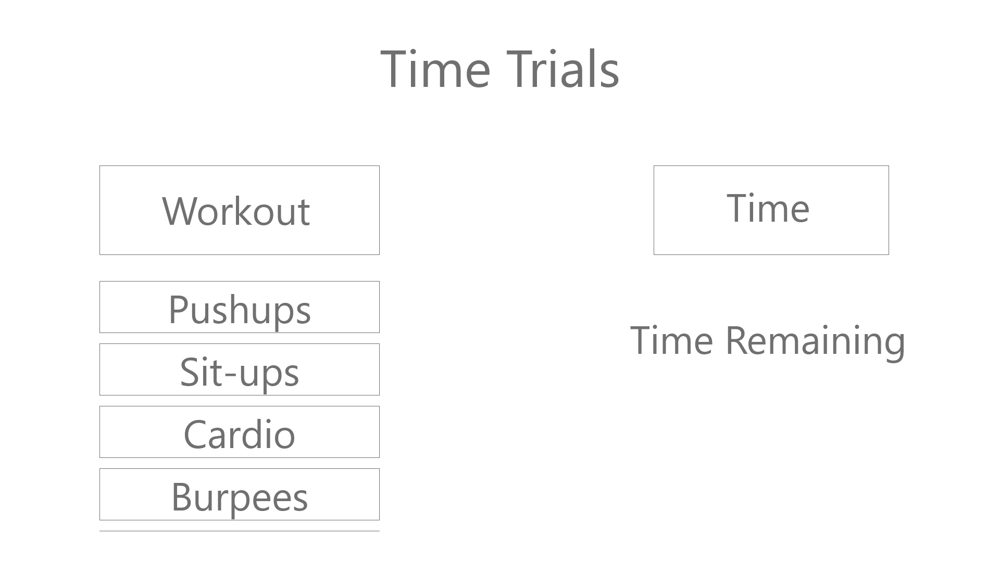
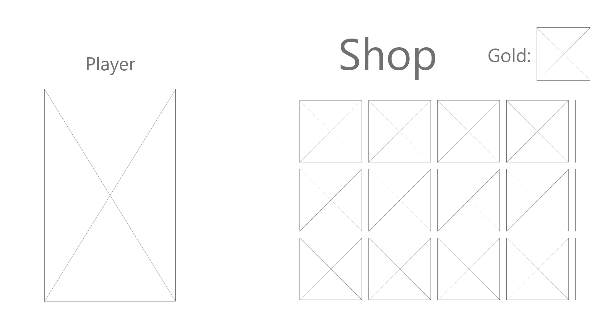
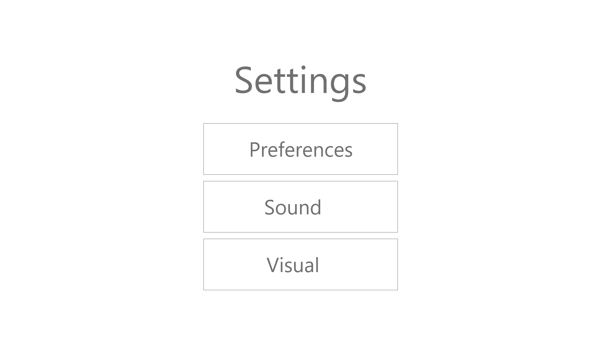

* Below is our homepage screen, which is solely the main menu.

* Below is the levels screen which showcases the choices players have for levels, as well as their daily challenges.

* Below is the boss fight screen which gives users the ability to do their own choice of workouts to chip away at the boss' healthbar.

* Below is the time trials screen which gives players a certain amount of time to complete whichever workout they'd like to work on.

* Below is the free workouts screen which will be just a list of workouts for users to complete to earn resources.

* Below is the character screen which is where players can find their inventory and customize their character.

* Below is the shop screen which will have changing gear for the player to purchase with their earned resources.

* Below is the settings screen, which will give the user a few options to change, such as sound and accesibility options.

* Below is the link to the entire wireframe in it's intended form.
* https://xd.adobe.com/view/6daa8ba0-2965-4658-8996-30ddce2cc379-38f9/?fullscreen&hints=off
